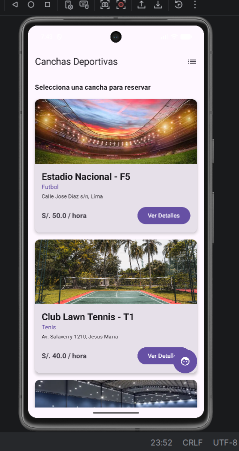
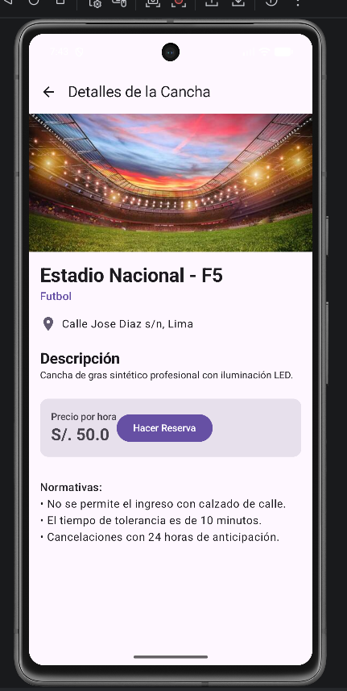
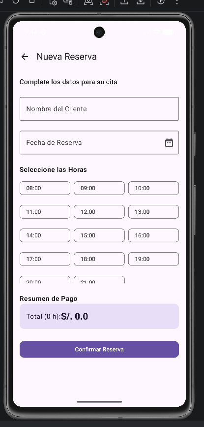
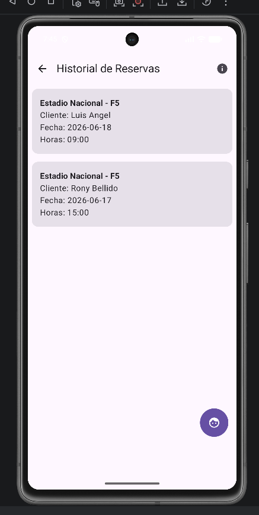
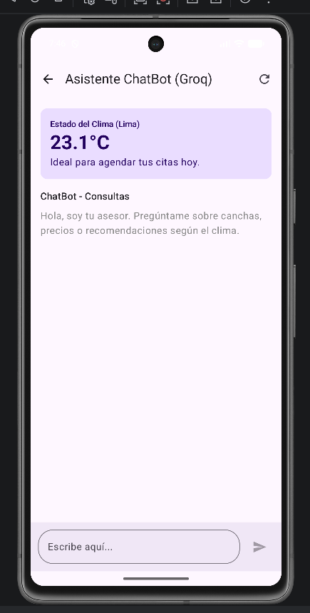
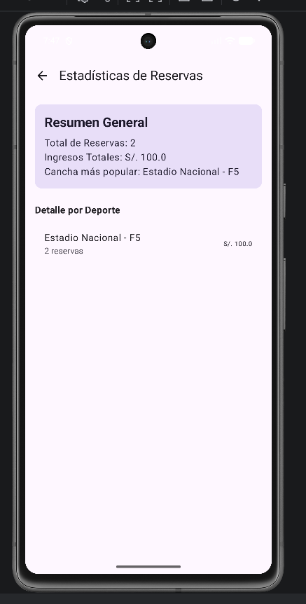

# Agenda de Citas Deportivas - Bellido Chambi Rony Widmer

## 📋 Información del Proyecto
*   **Autor:** Bellido Chambi Rony Widmer
*   **Temática:** Gestión y Agenda de Citas para Alquiler de Canchas Deportivas.
*   **Tecnologías Principales:** Kotlin, Jetpack Compose, Room, Retrofit, Groq Cloud API.

---

## ✅ Cumplimiento de Requisitos Técnicos
El proyecto ha sido desarrollado siguiendo estrictamente los lineamientos solicitados:

1.  **Interfaz (Compose):** 100% Jetpack Compose. Cuenta con más de 4 pantallas: Catálogo de Canchas, Detalle de Cancha/Reserva, Formulario CRUD, Historial de Reservas y Estadísticas.
2.  **Navegación:** Uso de `Navigation Compose` con paso de argumentos (IDs) entre pantallas para cargar datos específicos.
3.  **Arquitectura MVVM:** Implementación de ViewModels para la gestión de estado. Uso de `StateFlow` y `collectAsState()` para una UI reactiva. Las vistas están libres de lógica de negocio.
4.  **Persistencia Local (Room):** CRUD completo (Crear, Leer, Actualizar, Eliminar) sobre la entidad de reservas. Los datos persisten al cerrar la aplicación.
5.  **Consumo de API (Retrofit):** Integración con la API de Clima (Open-Meteo) y Groq Cloud para el asistente de IA, manejando estados de Carga, Éxito y Error.
6.  **Patrón Repository:** El `CanchaReservationRepository` actúa como única fuente de verdad, abstrayendo el acceso a la base de datos local y a los servicios web.

---

## 🏛️ Aplicación de MVVM
La arquitectura separa las responsabilidades de forma clara:
*   **Model:** Representado por las entidades de Room y clases de datos de Retrofit.
*   **View (Composables):** Observan el `UiState` expuesto por el ViewModel y renderizan la interfaz según el estado actual.
*   **ViewModel:** Procesa los eventos de la UI, interactúa con el Repository y mantiene el estado mediante `StateFlow`.

---

## 📸 Capturas de Pantalla

### 1. Pantalla Principal (Canchas)

### 2. Detalle de la Cancha

### 3. Formulario de Reserva (CRUD - Crear/Editar)

### 4. Historial de Reservas (CRUD - Leer/Eliminar)

### 5. Asistente IA y Clima (API)

### 6. Estadísticas de Reservas (Pantalla Adicional)

